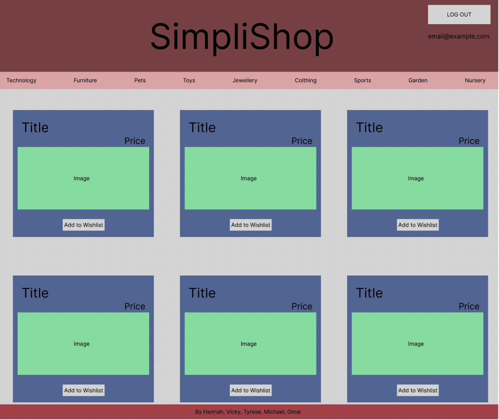

 # SimpliShop 🛒 
## Multiverse Final Group Project 
#### Created by Hannah, Vicky, Tyrese, Michael and Omar

#### This is the **front end repo** --> [Click here for the backend repo](https://github.com/MBailey114/springBackEnd) 

**_PROJECT IDEA_**  
Initial idea: Creating an E-Commerce website 

Facebook Marketplace replica - We’re aiming to replicate the functionality and features of an e-commerce website similar to Facebook marketplace

Extension: Amazon replica - If we can successfully implement the features of a Facebook Marketplace website, displaying items from the backend, functionality for contacting sellers, adding items etc, we hope to add additional features so the user 

**_MINIMUM VIABLE PRODUCT_**  
Aim: Create a Facebook Marketplace replica  
[E-Commerce website - Java/Spring backend + React frontend] 

* Login page: User can log into the website and browse item (Validating users) 
* Database - PostgreSQL 
* Routes for each request (GET, POST, PUT, DELETE)
* Displaying items from the database with their attributes 
* Clicking on each item, displaying details on a new page
* Upload a new item
* Edit an existing item - if user uploaded it
* Delete an existing item - if user uploaded it
* Navbar [Searchbar, Look up items by category, Wishlist, Recently viewed items]

**_EXTENSION FEATURES_**  
Aim: Create an Amazon Replica to allow the User to purchase items online  
[E-Commerce website - Java backend + React frontend] 

* Shopping Basket - adding an item to their basket 
* Checkout and payment method - purchasing items, having an FK for the items being purchased. 
* Many-to-many relationship between User and Item 
    * Many users can have many items 
    * Quantity decreases as user’s purchase them  

**_BACKEND: ENDPOINTS_**  
Item Table 
* Get all items being sold (/items/all)
* Get one Item being sold (/items/:id)
* Get items being sold by category (/item/:category)
* Post (add) Item to database (/items)
* Delete Listing of item from database (/items/:id)
* Edit Listing of item (/items/:id)

User Table  
* Get User (/users)
* Post user when creating account (/users)
* Delete Listing of item from database (/users/:id)
* Edit user (/user/:id)

Validation and error handling  
* Validation for user
* Validation for items
* Error handling for user
* Error handling for items

**_BACKEND: MODELS_**  
User 
* Long userID (PK)
* String firstName 
* String lastName
* String password
* String emailAddress
* Array basket
* Array wishlist

Item 
* Long itemID (PK)
* String name 
* String image
* String description 
* String category
* Integer quantity 
* Double price

**_FRONT END MOCKUP_**    
 

